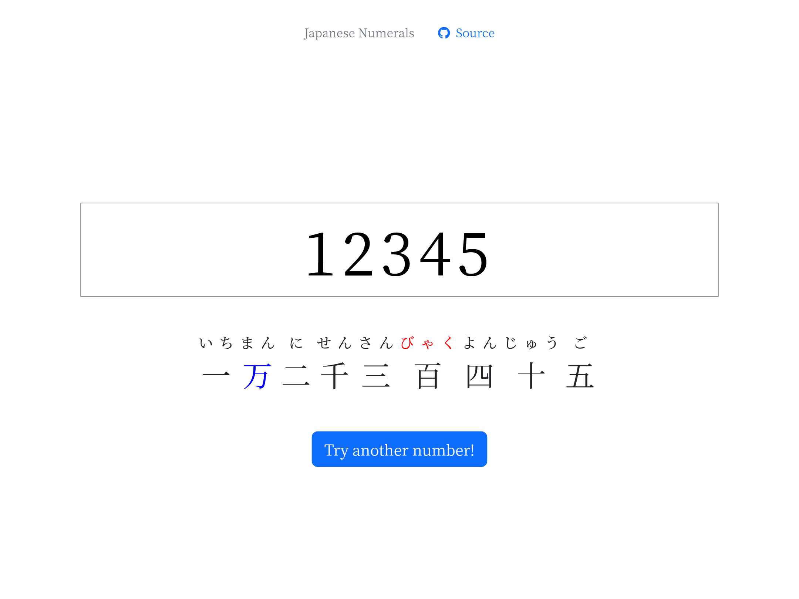

# Japanese Numerals

A little tool used to practice Japanese numerals. :)

:warning: There are still some incorrect results with numbers above 10000000 to be confirmed and fixed.

This project is built with [React](https://reactjs.org/), [HTM](https://github.com/developit/htm) and [Bootstrap](https://getbootstrap.com/).

Try it here: <https://zetaraku.dev/JapaneseNumerals/>

## Screenshots

## Features

- Supports numbers from **0** up to **1072 - 1**
- **Special pronunciations** are colored **red**
- **Major delimiters** are colored **blue**
- Press the button to get a **random number** (from 0 to 9999)

## License

Copyright © 2022 Raku Zeta.

Licensed under the [MIT License](./LICENSE).
